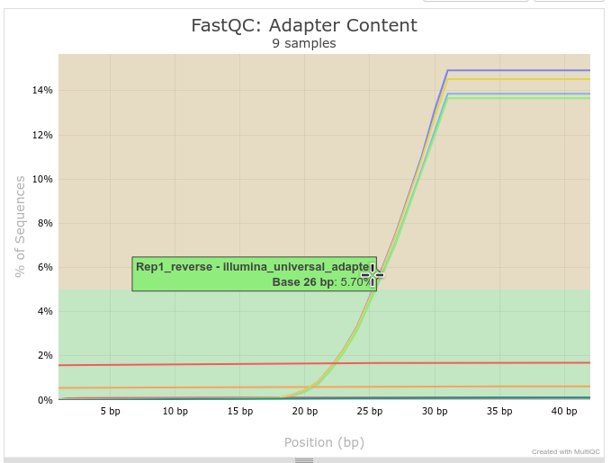
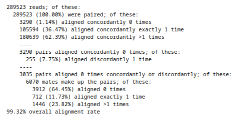
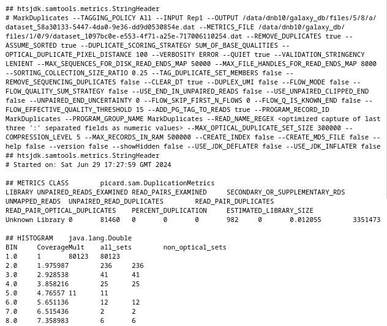
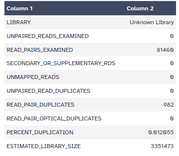
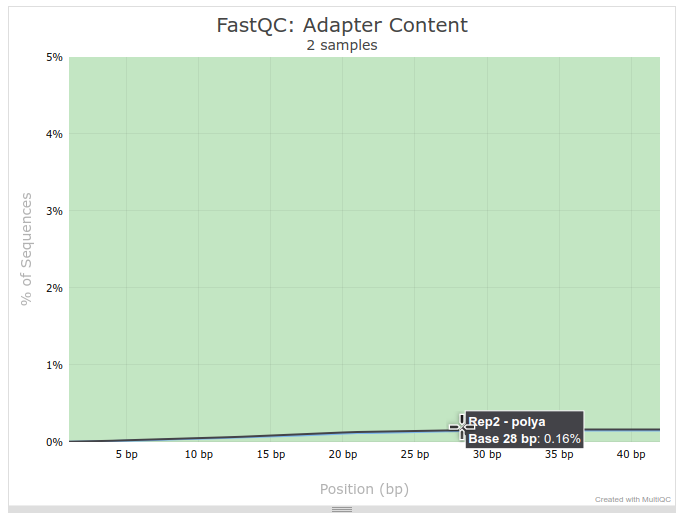
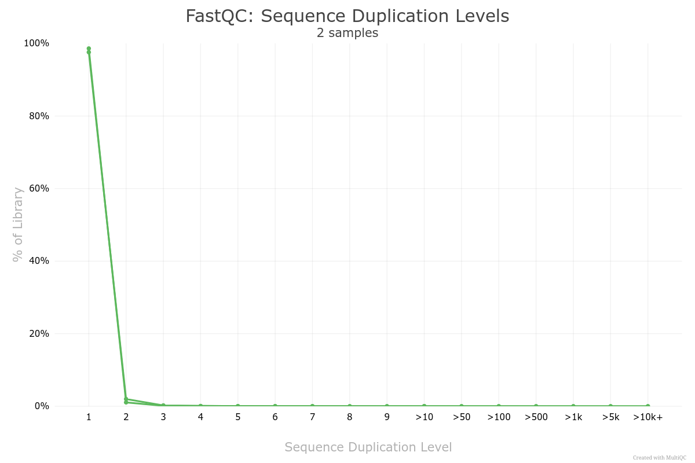
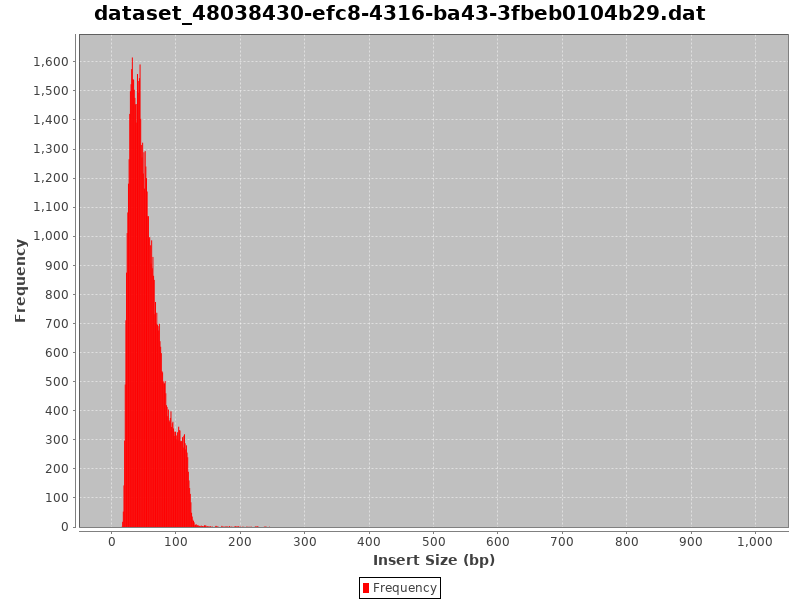
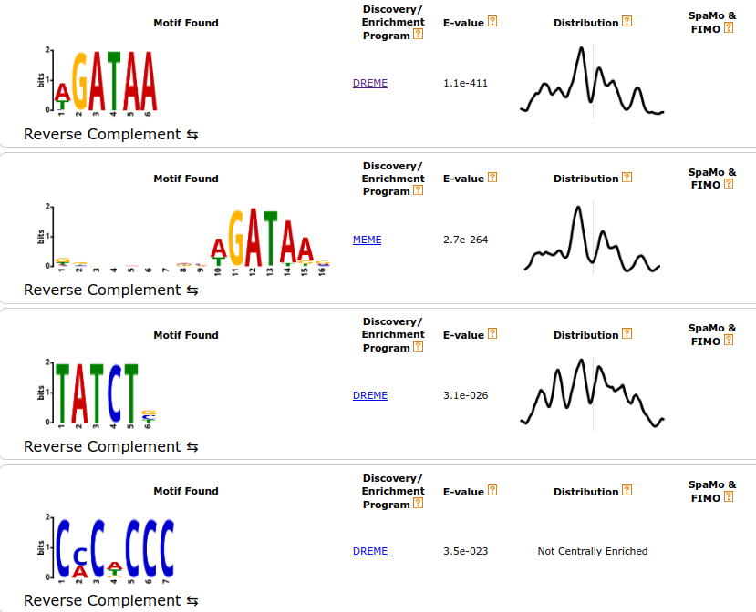

In many organism, {TF} play an important tole in the regulation of the gene expression. In human, we have up to 2,800 proteins and more than 1,600 are
TF ([list of transcription factors](https://en.wikipedia.org/wiki/List_of_human_transcription_factors)), although the number might change over timer.
Investigating the role of TFs, such as [GATA1](https://en.wikipedia.org/wiki/GATA1), is a very important task to understand the regulatory mechanisms in the cell and thus ascertain
the source of a disease, such as [myelofibrosis](https://en.wikipedia.org/wiki/Primary_myelofibrosis) a type of blood cancer.


{CUT&RUN}  became the new and advanced method to analyse DNA-associated proteins. CUT&RUN uses an antibody just as [ChIP-Seq](https://en.wikipedia.org/wiki/ChIP_sequencing) to select the {POI}.
The big difference, CUT&RUN couples the usage of an antibody with the usage of a pA-MNase, which you can see in **Figure 1**. In the revised version of the protocol ,
the pA-MNase has been replaced by a {pA(G)-MNase} to expand this technology to mouse primary antibodies. The [enzyme](https://en.wikipedia.org/wiki/Micrococcal_nuclease) fused to the protein A/G is an
endo-exonuclease that cleaves and shortens DNA. The fusion will ensure that the MNase comes in close proximity with the POI and thus cleaves DNA *in-situ*, close to POI binding sites. CUT&RUN allows to
fragment the DNA in unfixed cells and thus allows to study protein-DNA interactions in a more natural state. The added pA(G)-MNase thus creates shorted fragments that lead to a higher resolution for the mapping
in comparison to your standard ChIP-Seq protocol. CUT&RUN follows four fundamental steps: (1) permeabilize the nuclei or cells coated on beads, (2) incubate with the selective antibody of the POI, (3)
add the pA(G)-MNase and activate the enzyme for a small period of time, (4) release CUT&RUN fragments and collect the DNA from the supernatant. Afterward, the DNA can be purified, PCR amplified and
prepared for sequencing. You can find the CUT&RUN protocol at [protocols.io](https://www.protocols.io/view/cut-amp-run-targeted-in-situ-genome-wide-profiling-14egnr4ql5dy/v3).

In this tutorial, we will use data from the study of . The article introduces a CUT&RUN pipeline that we will **not** completely follow. It is important to note at this point that
a CUT&RUN data analysis is more similar to an ATAC-Seq experiment than a standard ChIP-Seq. We will analyze the two biological replicates from a CUT&RUN experiment for the aforementioned TF GATA1 in humans.
We downsampled the data to speed up the run times in this tutorial. Our results will be compared to identified binding sites of GATA1 of a ChIP-Seq experiment .

## When working with real data
The workflow for this training material can be found [at the European Galaxy instance](https://usegalaxy.eu/u/heylf/w/copy-of-cutandrunlong). When you use your data we suggest using [this workflow](https://usegalaxy.eu/u/heylf/w/cutandrunlong)
which includes additional steps for your data analysis. Both workflows do not support peak calling with controls as CUT&RUN has a low background.
It is often recommended to use a positive or negative control as a comparison. Spike-in controls can be done for CUT&RUN but need then additional steps in the provided workflows to consider them.

> <agenda-title></agenda-title>
>
> In this tutorial, we will cover:
>
> 1. TOC
> {:toc}
>
{: .agenda}



# Step 1: Preprocessing

## Get Data

We first need to download the sequenced reads (FASTQs) as well as other annotation files. Then, to increase the number of reads that will map to the reference genome (here human genome version 38, GRCh38/hg38), we need to preprocess the reads.

> <hands-on-title>Data upload</hands-on-title>
>
> 1. Create a new history for this tutorial
>
>    
>
> 2. Import the files from [Zenodo](https://doi.org/10.5281/zenodo.6823059) or from
>    the shared data library (`GTN - Material` -> `{{ page.topic_name }}`
>     -> `{{ page.title }}`):
>
>    ```
>    https://zenodo.org/record/6823059/files/chip_seq_peaks.bed
>    https://zenodo.org/record/6823059/files/Rep1_R1.fastq
>    https://zenodo.org/record/6823059/files/Rep1_R2.fastq
>    https://zenodo.org/record/6823059/files/Rep2_R1.fastq
>    https://zenodo.org/record/6823059/files/Rep2_R2.fastq
>    ```
>
>    
>
>    
>
> 4. Add a tag called `#rep1` to the Rep1 files and a tag called `#rep2` to the Rep2 files.
>
>    
>
> 5. Check that the datatype of the 4 FASTQ files is `fastqsanger` and the peak file (chip_seq_peaks.bed) is `bed`. If they are not then change the datatype as described below.
>
>    
>
> 6. Create a paired collection named `2 PE fastqs`, and rename your pairs with the sample name followed by the attributes: `Rep1` and `Rep2`.
>
>    
>
> 7. Rename the bed file `GATA1 ChIP-Seq peaks`.
>
{: .hands_on}

> <comment-title>FASTQ format</comment-title>
> If you are not familiar with FASTQ format, see the [Quality Control tutorial]()
{: .comment}
>
> <comment-title>BED / encode narrowPeak format</comment-title>
> If you are not familiar with BED format or encode narrowPeak format, see the [BED Format](https://genome.ucsc.edu/FAQ/FAQformat.html)
{: .comment}

## Quality Control

We first have to check if our data contains adapter sequences that we have to remove. A typical CUT&RUN experiment has a read length of 30-80 nt. We can check the raw data quality with **FastQC**.

> <hands-on-title>Quality Control</hands-on-title>
>
> 1.  with the following parameters convert the list of pairs into a simple list:
>     - *"Input Collection"*: `2 PE fastqs`
>
> 2.  with the following parameters:
>       -  *"Raw read data from your current history"*: Choose the output of **Flatten collection**  selected as **Dataset collection**.
> 3. Inspect the web page output of **FastQC**  for the `Rep1_forward` sample. Check what adapters are found at the end of the reads.
>
>    > <question-title></question-title>
>    >
>    > 1. How many reads are in the FASTQ?
>    > 2. Which sections have a warning or an error?
>    >
>    > > <solution-title></solution-title>
>    > >
>    > > 1. There are 300,000 reads.
>    > > 2. The 4 steps below have warnings:
>    > >
>    > >    1. **Per base sequence content**
>    > >
>    > >       CUT&RUN has sometimes base biases like ChIP-Seq.
>    > >
>    > >    2. **Sequence Duplication Levels**
>    > >
>    > >       The read library quite often has PCR duplicates that are introduced
>    > >       simply by the PCR itself. We will remove these duplicates later on.
>    > >
>    > >    3. **Overrepresented sequences**
>    > >
>    > >       Our data contains TruSeq adapter, Illumina PCR Primer, and a read from the mitochondrial chromosome.
>    > >
>    > >    4. **Adapter Content**
>    > >
>    > >       Our data contains an adapter (Illumina Universal Adapter) that we still have to remove.
>    > >
>    > {: .solution}
>    >
>    {: .question}
>
>    As it is tedious to inspect all these reports individually we will combine them with .
>
> 4.  to aggregate the FastQC reports with the following parameters:
>    - In *"Results"*:
>        - *"Results"*
>            - *"Which tool was used generate logs?"*: `FastQC`
>                - In *"FastQC output"*:
>                    -  *"Insert FastQC output"*
>                        -  *"FastQC output"*: `FastQC on collection N: Raw data` (output of **FastQC** )
>
{: .hands_on}

> <comment-title>FastQC Results</comment-title>
> This is what you should expect from the **Adapter Content** section of multiQC:
> 
{: .comment}

The MultiQC report (of FastQC) pointed out that we have in our data some standard Illumina adapter sequences, which we will remove with Trim Galore!.

## Trimming Reads

**Trim Galore!** is a handy tool that can automatically detect and trim standard Illumina adapters.

> <hands-on-title>Task description</hands-on-title>
>
> 1.  with the following parameters:
>    - *"Is this library paired- or single-end?"*: `Paired Collection`
>        - *"Select a paired collection"*: select `2 PE fastqs`
>    - In *"Adapter sequence to be trimmed"*: `Illumina universal`
>    - *Avanced settings*: `Full parameter list`
>    - In *"Trim low-quality ends from reads in addition to adapter removal (Enter phred quality score threshold)"*: `30`
>    - In *"Discard reads that became shorter than length N"*: `15`
>    - In *"Generate a report file"*:   `Yes`
>
> 2. Click on the  (eye) icon of the report for `Rep1` and look for the info.
{: .hands_on}

> <question-title></question-title>
>
> 1. What percentage of reads contain adapters?
> 2. What percentage of reads are still longer than 15bp after the trimming?
>
> > <solution-title></solution-title>
> >
> > 1. ~55% for Read 1 and ~57% for Read 2
> > 2. The last line indicates that 3.5% of pairs have been removed.
> >
> {: .solution}
>
{: .question}

# Step 2: Mapping

## Mapping Reads to Reference Genome

Next, we map the trimmed reads to the human reference genome. Here we will use **Bowtie2**. We will extend the maximum fragment length (distance between read pairs) from 500 to 1000 because
we know some valid read pairs are from this fragment length. We will use the `--very-sensitive` parameter to have more chances to get the best match even if it takes a bit longer to run.
We will run the **end-to-end** mode because we trimmed the adapters, so we expect the whole read to map, no clipping of ends is needed. Regarding the genome to choose.
The hg38 version of the human genome contains [alternate loci](https://www.ncbi.nlm.nih.gov/grc/help/definitions/#ALTERNATE). This means that some regions of the genome
are present both in the canonical chromosome and on its alternate loci. The reads that map to these regions would map twice. To be able to filter reads falling into
repetitive regions but keep reads falling into regions present in alternate loci, we will map on the Canonical version of hg38 (only the chromosome with numbers, chrX, chrY, and chrM).

> <hands-on-title>Mapping reads to reference genome</hands-on-title>
>
> 1.  with the following parameters:
>    - *"Is this single or paired library"*: `Paired-end Dataset Collection`
>        - *"FASTQ Paired Dataset*: select the output of **Trim Galore!**  *"paired reads"*
>        - *"Do you want to set paired-end options?"*: `Yes`
>            - *"Set the maximum fragment length for valid paired-end alignments"*: `1000`
>    - *"Will you select a reference genome from your history or use a built-in index?"*: `Use a built-in genome index`
>        - *"Select reference genome"*: `Human (Homo sapiens): hg38 Canonical`
>    - *"Set read groups information?"*: `Do not set`
>    - *"Select analysis mode"*: `1: Default setting only`
>        - *"Do you want to use presets?"*: `Very sensitive end-to-end (--very-sensitive)`
>    - *"Do you want to tweak SAM/BAM Options?"*: `No`
>    - *"Save the bowtie2 mapping statistics to the history"*: `Yes`
>
> 2. Click on the  (eye) icon of the mapping stats `Rep1`.
{: .hands_on}

> <comment-title>Bowtie2 Results</comment-title>
> You should get similar results to this from Bowtie2:
> 
{: .comment}

> <question-title></question-title>
>
> What percentage of read pairs mapped concordantly?
>
> > <solution-title></solution-title>
> >
> > 36.47+62.39=98.86%
> >
> {: .solution}
>
{: .question}

# Step 3: Filtering Mapped Reads and second level Quality Control

## Filter Uninformative Reads

We apply some filters to the reads after the mapping. CUT&RUN datasets can have many reads that map to the mitochondrial genome because it is nucleosome-free and thus very accessible
to the pA(G)-MNase. CUT&RUN inserts adapter more easily in open chromatin regions due to the pA(G)-MNase activity. The mitochondrial genome is uninteresting for CUT&RUN,
so we remove these reads. We also remove reads with low mapping quality and reads that are not properly paired.

> <hands-on-title>Filtering of uninformative reads</hands-on-title>
>
> 1.  with the following parameters:
>    -  *"BAM dataset(s) to filter"*: Select the output of  **Bowtie2**  *"alignments"*
>    - In *"Condition"*:
>        -  *"Condition"*
>            - In *"Filter"*:
>                - *"Filter"*
>                    - *"Select BAM property to filter on"*: `Mapping quality`
>                        - *"Filter on read mapping quality (phred scale)"*: `>=30`
>                -  *"Insert Filter"*
>                    - *"Select BAM property to filter on"*: `Proper Pair`
>                        - *"Select properly paired reads"*: `Yes`
>                -  *"Insert Filter"*
>                    - *"Select BAM property to filter on"*: `Reference name of the read`
>                        - *"Filter on the reference name for the read"*: `!chrM`
>    - *"Would you like to set rules?"*: `False`
>
>
> 2. Click on the input and the output BAM files of the filtering step. Check the size of the files.
>
{: .hands_on}

> <question-title></question-title>
>
> 1. Based on the file size, what proportion of alignments was removed (approximately)?
> 2. Which parameter should be modified if you are interested in repetitive regions?
>
> > <solution-title></solution-title>
> >
> > 1. The original BAM files are 14-15 MB, the filtered ones are 5.8 and 7.1 MB. Approximately half of the alignments were removed.
> >
> > 2. You should modify the mapQuality criteria and decrease the threshold.
> >
> {: .solution}
>
{: .question}

## Filter Duplicate Reads

Because of the PCR amplification, there might be read duplicates (different reads mapping to the same genomic region) from over amplification of some regions. We will remove them with **Picard MarkDuplicates**.

> <hands-on-title>Remove duplicates</hands-on-title>
>
> 1.  with the following parameters:
>    -  *"Select SAM/BAM dataset or dataset collection"*: Select the output of  **Filter**  *"BAM"*
>    - *"If true do not write duplicates to the output file instead of writing them with appropriate flags set"*: `Yes`
>
>    > <comment-title>Default of  **MarkDuplicates** </comment-title>
>    >
>    > By default, the tool will only "Mark" the duplicates. This means that it will change the Flag of the duplicated reads to enable them to be filtered afterwards. We use the parameter *"If true do not write duplicates to the output file instead of writing them with appropriate flags set"* to directly remove the duplicates.
>    {: .comment}
>
> 2. Click on the  (eye) icon of the MarkDuplicate metrics.
{: .hands_on}

> <comment-title>MarkDuplicates Results</comment-title>
> You should get a similar output to this from MarkDuplicates:
> 
{: .comment}

> <tip-title>Formatting the MarkDuplicate metrics for readability</tip-title>
>
> 1.  with the following parameters:
>    -  *"Select lines from"*: Select the output of  **MarkDuplicates** 
>    - *"that*: `Matching`
>    - *"the pattern*: `(Library|LIBRARY)`
> 2. Check that the datatype is tabular. If not, change it.
>
>    
>
> 3. :
>    -  *"Select lines from"*: Select the output of **Select** 
>
> 
>
{: .tip}

> <question-title></question-title>
>
> 1. How many pairs were in the input?
> 2. How many pairs are duplicates?
>
> > <solution-title></solution-title>
> >
> > 1. 81460
> > 2. 982
> >
> {: .solution}
>
{: .question}

Once again, if you have a high number of duplicates it does not mean that your data are not good, it just means that you sequenced
too much compared to the diversity of the library you generated. Consequently, libraries with a high portion of duplicates should not be re-sequenced as this would not increase the amount of data.

## Check Deduplication and Adapter Removal

> <hands-on-title>Check Adapter Removal with FastQC</hands-on-title>
>
> 1.  with the following parameters:
>       -  *"Raw read data from your current history"*: select the output of **MarkDuplicates** BAM.
>
> 2.  to aggregate the FastQC reports with the following parameters:
>    - In *"Results"*:
>        - *"Results"*
>            - *"Which tool was used generate logs?"*: `FastQC`
>                - In *"FastQC output"*:
>                    -  *"Insert FastQC output"*
>                        -  *"FastQC output"*: `FastQC on collection N: Raw data` (output of **FastQC** )
>
{: .hands_on}

> <comment-title>FastQC Results</comment-title>
> Now, you should see under **Overrepresented sequences** that there is no more overrepresented sequences and under **Adapter Content** that the Illumina adapters are no longer present.
> 
> However, you may have noticed that you have a new section with warning: **Sequence Length Distribution**. This is expected as you trimmed part of the reads.
> Furthermore, you will notice under **Sequence Duplication Levels** that we removed nearly all PCR duplicates.
> 
{: .comment}

## Check Insert Sizes

We will check the insert sizes with **Paired-end histogram** of insert size frequency. The insert size is the distance between the R1 and R2 read pairs. This tells us the size of the DNA fragment the read pairs came from. The fragment length distribution of a sample gives an excellent indication of the quality of the CUT and RUN experiment.

> <hands-on-title>Plot the distribution of fragment sizes</hands-on-title>
>
> 1.  with the following parameters:
>    -  *"BAM file"*: Select the output of  **MarkDuplicates**  *"BAM output"*
>    - *"Lower bp limit (optional)"*: `0`
>    - *"Upper bp limit (optional)"*: `1000`
>
> 2. Click on the  (eye) icon of the lower one of the 2 outputs (the png file).
{: .hands_on}

> <comment-title>Paired-end histogram Results</comment-title>
> This is what you get from Paired-end histogram:
> 
{: .comment}

> <question-title></question-title>
>
> Could you guess what the peaks at approximately 30bp correspond to?
>
> > <solution-title></solution-title>
> >
> > The first peak (30bp) corresponds to where the cleavage around our POI. Nevertheless, the cutting of our pA(G)-MNase-antibody-protein complex is not perfect. The arms can actually cut further away from the protein. Little bumps in the distribution are an indication of another protein(complex), such as a nucleosome that is located between the two cleavage sites.
> >
> {: .solution}
>
{: .question}

This fragment size distribution is a good indication if your experiment worked or not. The CUT&RUN yield can gradually increase over the digestion time , which of course depends on the enzyme used for the cleavage of the DNA.

. The track with No_Ab is the control experiment. Data is from two biological replicates. The studied protein showed fragments of size ≤120 bp corresponding to the binding sites, as seen on the left, whereas reads with ≥150 bp fragment size are randomly distributed in the local vicinity. The yield in the example increases from 5s to 10 minutes, which can be seen in the mapped profiles in the right. (Skene and Henikoff 2017 eLife)")

# Step 4: Peak calling

## Call Peaks

We have now finished the data preprocessing. Next, to find regions corresponding to potential binding sites, we want to identify regions where reads have piled up (peaks) greater than the background read coverage. [MACS2](https://github.com/taoliu/MACS) is widely used for CUT&RUN.

At this step, two approaches exist: Like in ATAC-Seq, we have to take a few things into account. The pA(G)-MNase does not need to bind the protein it can create fragments unspecifically a
few bases downstream and upstream away from the true binding site. This is to the *"long"* arms of the proteins. A big jump can happen if a nucleosome is between the protein binding site and the cutting site.

It is critical to re-center the signal since the pA(G)-MNase cuts in different distances. Since some read pairs are not symmetric (i.e., the first mate might be further away from the
binding site than the second mate) we will turn off the shifting mode of MACS2 and apply a direct shift. If we only assess the coverage of the 5' extremity of the reads, the data would be too sparse,
and it would be impossible to call peaks. Thus, we will extend the start sites of the reads by 200bp (100bp in each direction) to assess coverage.

### Using MACS2

We convert the BAM file to BED format because when we set the extension size in MACS2, it will only consider one read of the pair while here we would like to use the information from both.

> <hands-on-title>Convert the BAM to BED</hands-on-title>
>
> 1.  with the following parameters:
>    -  *"Convert the following BAM file to BED"*: Select the output of **MarkDuplicates**  BAM output
>
{: .hands_on}

We call peaks with MACS2. To get the coverage centered on the 5' extended 100bp each side we will use `--shift -100` and `--extend 200`:


> <hands-on-title>Call peaks with MACS2</hands-on-title>
>
> 1.  with the following parameters:
>    - *"Are you pooling Treatment Files?"*: `No`
>        -  Select the output of **bedtools BAM to BED** converter 
>    - *"Do you have a Control File?"*: `No`
>    - *"Format of Input Files"*: `Single-end BED`
>    - *"Effective genome size"*: `H. sapiens (2.7e9)`
>    - *"Build Model"*: `Do not build the shifting model (--nomodel)`
>        - *"Set extension size"*: `200`
>        - *"Set shift size"*: `-100`. It needs to be - half the extension size to be centered on the 5'.
>    - *"Additional Outputs"*:
>        - Check `Peaks as tabular file (compatible with MultiQC)`
>        - Check `Peak summits`
>        - Check `Scores in bedGraph files`
>    - In *"Advanced Options"*:
>        - *"Composite broad regions"*: `No broad regions`
>            - *"Use a more sophisticated signal processing approach to find subpeak summits in each enriched peak region"*: `Yes`
>        - *"How many duplicate tags at the exact same location are allowed?"*: `all`
>
>    > <comment-title>Why keeping all duplicates is important</comment-title>
>    >
>    > We previously removed duplicates using **MarkDuplicates**  using paired-end information. If two pairs had identical R1 but different R2, we knew it was not a PCR duplicate. Because we converted the BAM to BED we lost the pair information. If we keep the default (removing duplicates) one of the 2 identical R1 would be filtered out as duplicate.
>    {: .comment}
>
{: .hands_on}

# Step 5: Identifying Binding Motifs

## Prepare the Datasets


### Extracting individual replicates from your dataset collection

In the following step, we want to apply a tool to identify robust peaks between our two replicates. However, we still have one dataset collection, holding both replicates, which we have to split.

> <hands-on-title>Extract replicates from a dataset collection:</hands-on-title>
>
> 1.  with:
>    -  *"Input List"*: `MACS2 callpeak on collection N (narrow Peaks)`
>    - *"How should a dataset be selected?"*: `Select by index`
>    - *"Element index:"*: `0`
>
>    You can use the arrow to rerun the same tool just changing the last parameter:
>
> 2.  with:
>    -  *"Input List"*: `MACS2 callpeak on collection N (narrow Peaks)`
>    - *"How should a dataset be selected?"*: `Select by index`
>    - *"Element index:"*: `1`
{: .hands_on}

### Extract Robust Peaks
MACS helped us to identify potential binding sites for GATA1. Yet, our peak set will contain false positives because of technical and biological noise.
We can first try to reduce some noise using the results for our two biological replicates. Since we applied MACS we have created two peak files.
Yet, both replicates have peaks that are only present in one replicate and thus might be a potential false positive due to noise.
We can remove such peaks if we simply overlap the two peak files and consequently search for peaks that appear in both replicates.

> <hands-on-title>Select robust GATA1 peaks:</hands-on-title>
>
> 1.  with the following parameters:
>    -  *"File A to intersect with B"*: Select `Rep1`
>    - *"Combined or separate output files"*: `One output file per 'input B' file`
>        -  *"File B to intersect with A"*:  Select `Rep2`
>    - *"Calculation based on strandedness?"*: `Overlaps occurring on either strand`
>    - *"Required overlap"*: `Specify minimum overlap(s)`
>        - *"Minimum overlap required as a fraction of A"*: `0.5`
>        - *"Require that the fraction of overlap be reciprocal for A and B"*: `Yes`
>    - *"Write the original A entry _once_ if _any_ overlaps found in B.": `Yes`
>
> 2. Rename the datasets `Robust GATA1 CUT and RUN peaks`.
>
> > <question-title></question-title>
> >
> > How many potential true positives do we obtain?
> > How many potential false positives have we removed?
> > Why have we set specified an overlap fraction of A with `0.5`?
> > Why have we set **"Require that the fraction of overlap be reciprocal for A and B"**?
> >
> > > <solution-title></solution-title>
> > >
> > > 1. 2,865 peaks
> > > 2. We started with 6,314 and 7,678 peaks. Thus, we could remove 3,449 and 4,813 peaks.
> > > 3. Finding robust peaks is a tricky process and not as simple as you think. Our approach defines a robust peak as an entity that is covered by two similar peaks in either one of the peak files of our two replicates. Our measurement for similarity is simply the amount of bases the peaks overlap. Yet, ask yourself, how much overlap do you need to state that they are similar? Is 1 base enough or maybe 10? The answer is not true or false and like so often needs more investigation. We define the overlap by a 50% fraction of each of the peak files. That means, if our peak in A is 100 bases then A has to overlap with 50 bases with the peak in file B.
> > > 4. **"Require that the fraction of overlap be reciprocal for A and B"** means that 50% of the peak in file A overlaps with the peak in file B and also 50% of the peak in file B overlaps with the peak in file A. We set this to make our filtering very conservative and filter for peaks that we can be sure are true positives. For example, A has a 10 bp peak that overlaps a peak in B with 100 bp. **Viewpoint of file A:** An overlap-fraction of 0.5 for A means that we accept peak A if it overlaps with 5 bp with the peak in B. This is very likely because the peak in B is 100 bp long. **Viewpoint of file B**: An overlap-fraction of 0.5 for B means that we reject A no matter what, even if A completely overlaps B because 10 bp are not enough to cover 50% of B. That is to say the option **"Require that the fraction of overlap be reciprocal for A and B"** takes care that we trust peaks that have in file A **and** in file B a fair overlap.
> > {: .solution}
> >
> {: .question}
{: .hands_on}

Note, that this is one way to define robust peaks. Yet, there are more sophisticated algorithms in Galaxy, such as
, and other methods that can help to define a robust peak.
The tool **IDR** has not been tested so far for CUT and RUN.

### Extract Positive Peaks

We can further remove some noise with a positive control, that is why we have downloaded a peak set from a ChIP experiment of GATA1.

> <hands-on-title>Select GATA1 peaks from ChIP-Seq data:</hands-on-title>
>
> 1.  with the following parameters:
>    -  *"File A to intersect with B"*: Select **Robust GATA1 CUT and RUN peaks**
>    - *"Combined or separate output files"*: `One output file per 'input B' file`
>        -  *"File B to intersect with A"*:  Select the dataset `GATA1 ChIP-Seq peaks`
>    - *"Calculation based on strandedness?"*: `Overlaps occurring on either strand`
>    - *"Required overlap"*: `Specify minimum overlap(s)`
>        - *"Minimum overlap required as a fraction of A"*: `0.5`
>        - *"Require that the fraction of overlap be reciprocal for A and B"*: `No`
>    - *"Write the original A entry _once_ if _any_ overlaps found in B.": `Yes`
>
> 3. Rename the datasets `True GATA1 CUT and RUN peaks`.
>
> > <question-title></question-title>
> >
> > How many potential true positives have we found (common between CUT&RUN and ChIP-seq) ?
> > How many potential false positives have we removed?
> > What is the precision of our analysis at this point? (Precision = True Positive / True Positive + False Positive)
> >
> > > <solution-title></solution-title>
> > >
> > > 1. 2,809 peaks
> > > 2. 56 peaks
> > > 3. Our precision is ~ 98%. A high precision is an indicator that we can predict true binding regions with high confidence.
> > {: .solution}
> >
> {: .question}
{: .hands_on}

### Extract DNA sequence

> <hands-on-title>Obtain DNA sequences from a BED file</hands-on-title>
>
> 1.  with the following parameters:
>    -  *"Fetch sequences for intervals in"*: Select **True GATA1 CUT and RUN peaks**
>    - *"Interpret features when possible"*: `No`
>    - *"Choose the source for the reference genome": `locally cached`
>    - *"Using reference genome"*: `hg38`
>    - *"Select output format"*: `fasta`
>    - *"Select fasta header format"*: `bedtools getfasta default`
>
{: .hands_on}

## Motif detection with MEME-ChIP

Let's find out the sequence motifs of the TF GATA1. Studies have revealed that GATA1 has the DNA binding motif (T/A)GATA(A/G) . In this last task we search for this motif in our data.

> <hands-on-title>Motif detection</hands-on-title>
>
> 1.   with the following parameters:
>    -  *"Primary sequences"*: Select the output of **Extract Genomic DNA** using coordinates from assembled/unassembled genomes 
>    - *"Sequence alphabet"*: `DNA`
>    - *"Options Configuration"*: `Advanced`
>        - *"Should subsampling be random?"*: `Yes`
>            - *"Seed for the randomized selection of sequences"*: `123`
>        - *"E-value threshold for including motifs"*: `0.05`
>        - *"What is the expected motif site distribution?"*: `Zero or one occurrence per sequence`
>        - *"Minimum motif width"*: `5`
>        - *"Maximum motif width"*: `20`
>        - *"Maximum number of motifs to find"*: `5`
>        - *"Stop DREME searching after reaching this E-value threshold"*: `0.05`
>        - *"Stop DREME searching after finding this many motifs"*: `5`
>    - *"I certify that I am not using this tool for commercial purposes."*: `Yes`
> 2. View the **MEME-ChIP** HTML.
>
> > <question-title></question-title>
> >
> > What is the E-value of the main motif?
> > How many peaks support the main motif GATA?
> >
> > > <solution-title></solution-title>
> > >
> > > 1. 1.1e-411
> > > 1. You need to click on the DREME link for the GATA motif. Then when you are in the DREME html, click on the arrow pointing down for the first motif (HGATAA) in the More column. Here, it gives you some numbers including how many peaks were positive for the motif. Here 1939.
> > {: .solution}
> >
> {: .question}
{: .hands_on}



Let us first investigate the result of MEME-ChIP. **First column:** The x-axis of the sequence plots represents the nucleotide position of the motif.
The y-axis stands for the total information (uncertainty) and thus stands for the probability that the nucleotide at a certain position is the specific letter (for DNA: T,C,G,A).
Bigger letters stand for a higher probability. For more information please read [the corresponding Wikipedia page](https://en.wikipedia.org/wiki/Sequence_logo). **Second column:** Defines the algorithm that found the sequence motif.
MEME-ChIP uses two different approaches called MEME and DREME, which can find more complex or simpler motifs. More information about these tools can be found [in the Meme documentation](http://meme-suite.org/).
**Third column:** Defines the E-value, which represents the expected number of times we would find our sequence motif in a database (peak file), just by chance.
This means, that a small E-value corresponds to a very significant motif because the expected number we would find that motif in our peak file just by chance is very low.
Other sequences like repeats will have a high E-value on the other hand. **Fourth column:** This graph is the result of CentriMo, a tool that shows the distribution of
the best matches for that particular motif. The vertical line is the center of the motif. Therefore, if you have a long sequence motif CentriMo helps you to pinpoint a smaller sub-motif.
You can find more information on CentriMo [in the Meme documentation](https://meme-suite.org/meme/doc/centrimo.html).

The results of MEME-ChIP endorse the findings about the DNA binding motif (T/A)GATA(A/G) . We also found other motifs, that might be secondary sequence motifs.
This, we could test with a deeper analysis.

# Conclusion

In this training, you have learned the general principles of CUT&RUN data analysis. CUT&RUN is a method to analyse DNA-associated proteins. In contrast to ChIP-seq, CUT&RUN couples the
antibody with a pA(G)-MNase to reduce the size of the obtained sequences to increase the accuracy for the detection of the protein interaction. Based on this training material,
you gained some insights into the quality control of the data. You should know some pitfalls of CUT&RUN and look for adapter contamination and PCR duplicates, which disrupt the later enrichment analysis.
You learned about **Bowtie2** to do the alignment, and how to filter for properly paired, good-quality and reads that do not map to the mitochondrial genome. Furthermore, you learned that
an indicator for a good CUT&RUN experiment is the fragment size plot and that you optimize your protocol based on this parameter. With **MACS2** we identified enriched regions, but
we had to remove some noise. We performed some robust peak analysis with **bedtools intersect** and performed a check with a ChIP-Seq experiment to remove some false positives.
Finally, we used **MEME-ChIP** to identify our binding motifs.


