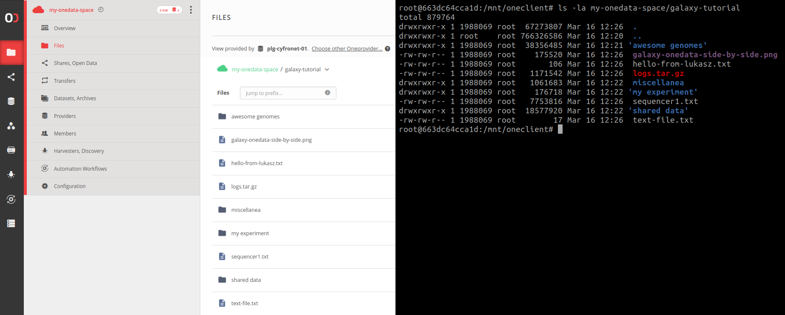
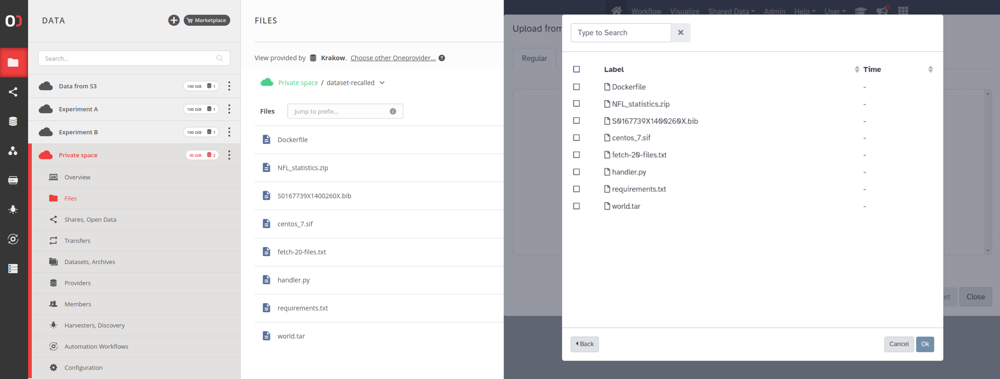

> <agenda-title></agenda-title>
>
> 1. TOC
> {:toc}
>
{: .agenda}

# Introduction to Onedata

Onedata ([https://onedata.org](https://onedata.org)) is a data management platform that
provides easy and unified access to globally distributed storage resources, supporting a
wide range of use cases from personal data management to data-intensive scientific
computations. It is an [open-source project](https://github.com/onedata), started in 2013,
and implemented by the team from the Cyfronet Computing Center in Krakow, Poland. 

Onedata creates a virtual file system layer spanning geographically dispersed computing
centers and data providers that host heterogeneous storage resources. The virtual file
system is POSIX-compatible and based on a classic structure of directories and files. The
virtualized data can be access using multiple interfaces: Web GUI, REST API, CDMI API,
fuse-based POSIX mount, Python libraries, or S3. Regardless of the interface, the user
gets the same, unified view of all his data.


Onedata uses the concept of **Spaces** for data organization. A **Space** is a logical
data volume that appears as a monolithic file system from the user’s PoV. Still, it
virtualizes the physical data stored on distributed storage systems of different data
providers. Spaces facilitate collaborative data sharing between users and groups across
organizational domains — using the Onedata interfaces, users can manage and access the
data together in a unified namespace, while it is physically distributed. 


The [Oneclient](https://onedata.org/#/home/documentation/topic/stable/oneclient) 
software, based on the [fuse](https://github.com/libfuse/libfuse) library, 
allows mounting the Onedata file system locally, either on a personal computer,
or on a worker node in a computing cluster for 
[HPC purposes](https://onedata.org/#/home/documentation/topic/stable/oneclient-direct-io). 



Similarly to the Galaxy project, The Onedata software can be used to build different
ecosystems. Each Onedata ecosystem constitutes an independent data management platform, 
made up of multiple data centers. One of the flagship examples is 
[EGI DataHub](https://datahub.egi.eu), a Europe-wide ecosystem bringing together 17
data sites (as of 03-2025) and catering for many scientific projects around Europe.

For more information about Onedata, see the 
[Documentation](https://onedata.org/#/home/documentation) and 
[API reference](https://onedata.org/#/home/api).


# Onedata & Galaxy integration

Thanks to the efforts undertaken in the
[EuroScienceGateway](https://galaxyproject.org/projects/esg/) project, Galaxy
now offers integration with Onedata. It can be used as 
a **remote source for data import/export** (a.k.a. Files Source Plugin) and as 
a **storage location for Galaxy datasets** (an Object Store). 
The integration includes **BYOS** (Bring Your Own Storage) and 
**BYOD** (Bring Your Own Data) templates.

Minimal requirements:
- **Galaxy**: version **24.2**
- **Onedata**: version **21.02.5** (but it's recommended to use at least **21.02.8**)

It is possible to connect multiple Onedata accounts in different Onedata
ecosystems to the same Galaxy account.

The below image shows the Onedata file browser UI and the Galaxy **Upload** tool
making it possible to import data stored in Onedata Spaces.



## What's the point?

There are many ways you (or your organization) can leverage the Onedata's
distributed data management capabilities in Galaxy:

* Onedata is all about unifying access to geographically distributed datasets.
  It may be your solution to integrate data from multiple data centers and
  bring them to Galaxy for processing.

* One of the crucial features of Onedata is seamless collaboration on data
  across different organizations. It supports groups that bring together users
  of different affiliations to work on datasets that are integrated from pieces
  coming from different data sources.

* Onedata offers powerful data sharing & publishing mechanisms and tools for
  long-term data archiving and replication, which you may find useful to improve
  your Galaxy data management.

* While Galaxy supports a plethora of different data sources and storage
  options, Onedata offers some additional storage drivers, like Ceph or XRootD.
  What can't currently be done directly via Galaxy, can be integrated into
  Galaxy through Onedata.

* If your data management and processing pipelines include other software
  besides Galaxy, the Onedata unified storage layer can help to better organize
  your environment, providing a common storage abstraction for different
  applications and pieces of middleware.

* Galaxy Pulsar and data distribution — the ongoing efforts in Galaxy to build a
  distributed network of Pulsar nodes is aligning well with the Onedata
  distributed storage model. By understanding the locality of the data, Galaxy
  will be able to schedule jobs in a smart way, assigning them to Pulsar nodes
  that are as close to the data as possible. This is where the Onedata Virtual
  Filesystem comes to play, allowing the management of data replication and
  distribution in a geographically aware manner. The synergy of distributed
  compute power and storage resources can greatly boost the scientific process,
  especially in projects that bring together people and datasets from different
  cooperating organizations.


# Accessing Onedata services

This guide will give you a kick-start, regardless if your organization is
already part of a Onedata ecosystem, you have access to Onedata services, or you
are entirely new to this software. 

Follow the Onedata
[user quickstart](https://onedata.org/#/home/documentation/topic/stable/user-quickstart)
tutorial to access the Onedata services. Newcomers can use the sandbox environment
to get familiar with the system.


## Access tokens

All Onedata connectors for Galaxy require an access token suitable for
data access in a Oneprovider service.

Follow the Onedata documentation to acquire an access token:
* GUI — follow the
  [guide](https://onedata.org/#/home/documentation/topic/stable/tokens-gui-guide),
  choosing a **Oneprovider REST/CDMI access** token template.
* REST API — to acquire an access token programatically, you can interact with 
  the [Onedata REST API](https://onedata.org/#/home/documentation/topic/stable/tokens-rest-api).

In most cases, the token **should not** be limited to read-only data access,
unless you wish to create a non-writable or publicly accessible Remote File
Source. In such a case, add a **Read-only** caveat to the token, as shown in the
[detailed guide](https://onedata.org/#/home/documentation/topic/stable/tokens-gui-guide).

Tokens can also limit the accessible spaces and providers by means of other 
[caveats](https://onedata.org/#/home/documentation/topic/stable/tokens-caveats).


## Choosing a Onedata Space

For the purposes of Remote File Sources, you do not have to designate a specific
**Space** — all of them will be available in the data import/export tools
(unless you have provided a restricted [access token](#access-tokens)). If 
you have followed the 
[user quickstart](https://onedata.org/#/home/documentation/topic/stable/user-quickstart) 
tutorial, you will be able to import from and export to the **Sandbox** Space.

In case of Storage Locations, you have to choose a specific Onedata **Space**
where the Galaxy data will be stored:

* A Space provided by your organization — if your institution is a part
  of a Onedata ecosystem, you may be assigned a specific Space for your
  Galaxy data.
* Your private Space — if you have access to a Onedata space for your
  own purposes, you can connect it as a Storage Location to Galaxy.
* The **Sandbox** Space — after following the Onedata
  [user quickstart](https://onedata.org/#/home/documentation/topic/stable/user-quickstart) 
  tutorial, you should have a personal, ACL-secured folder in the **Sandbox** Space.
  You may use it to as your Onedata Storage Location (possibly creating some nested
  directory structure inside, if needed).
* (Developers) a Space in a dev instance — if you are familiar with docker, you
  can 
  [set up a local Onedata deployment]()
  and use the **demo-space** as a Storage Location. Remember to disable TLS 
  certificate validation in the configs!


# Troubleshooting

In case you are getting errors when interacting with a Onedata 
remote source or storage location, go through the below checklist:

1. Avoid whitespace characters (spaces, tabs) in the Space names and
   file paths, as they are known to cause problems.

2. Make sure the Onezone domain is correct — open it in your Web browser to double-check.

3. Log in to the Onezone service and check if there is any service outage or 
   disrupted data providers — if so, you must wait for these problems to be solved. If not,
   you should assume the problem lies in the configuration of the Galaxy server or your
   user preferences.

4. Make sure the token you provided is suitable for REST API access in a
   Oneprovider service. Some setups require the token to be write-enabled.
   Consult the [access tokens](#access-tokens) section for a guide. 

5. Make sure the token allows access to at least one Onedata Space in at least
   one provider (Remote File Source), or the the Space designated as a Storage
   Location. Caveats (contextual confinements) may be limiting the access token
   scope.

6. Make sure there is at least one data provider backing up (supporting) the
   relevant Space(s).

7. If you are familiar with command-line, you may perform basic diagnostics on the
   token like this:

   ```bash
   curl -d '{"token": "'$TOKEN'"}' -H 'Content-type: application/json' \                                                                              130 ↵
        https://$ONEZONE_DOMAIN/api/v3/onezone/tokens/infer_access_token_scope | jq
   ```

   ```json
   {
     "validUntil":null,
     "dataAccessScope":{
       "spaces":{
         "d67622d2a0999be9b9b1e6e18c14c697chbfa6":{
           "supports":{
             "42a2fb7993b8331aa107ff819101b0f1chb73a":{
               "readonly":false
             }
           },
           "name":"space-alpha"
         },
         "readonly":false,
         "providers":{
           "42a2fb7993b8331aa107ff819101b0f1chb73a":{
             "version":"21.02.8",
             "online":true,
             "name":"My provider",
             "domain":"my-provider.example.com"
           }
         }
       }
     }
   }
   ```
   
   If there is at least one entry both in `spaces` and `providers`, and at least one of
   the providers is online, the token is viable. If not, you should see point 2) or
   consider creating a token with fewer confinements.

8. If you are a Dev/Admin, check the Galaxy logs for hints.


# Related tutorials

Learn more how to make use of the Galaxy & Onedata integration:

| Audience         | Topic                                                                                                                                            |
| ---------------  | -------------------                                                                                                                              |
| User             | [Importing (uploading) data from Onedata]()                                  |
| User             | [Exporting to Onedata remote]()                                  |
| User             | [Onedata user-owned storage]()                                            |
| Admin            | [Configuring the Onedata integration (remotes, Object Store, BYOS, BYOD)]() |
| Developer        | [Setting up a dev Onedata instance]()                                          |
